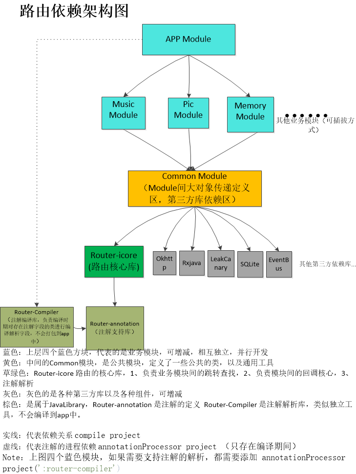
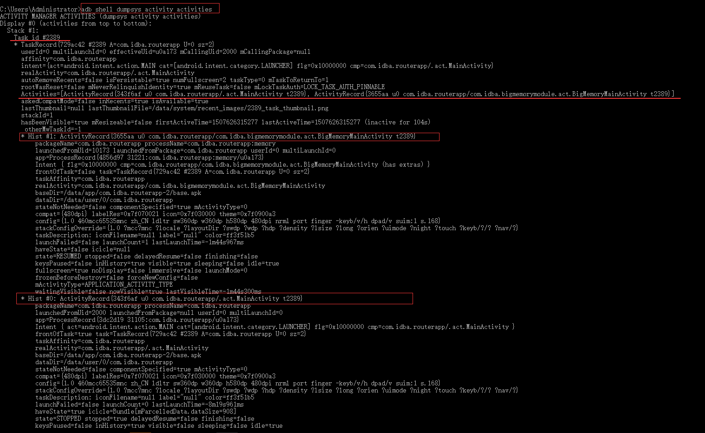
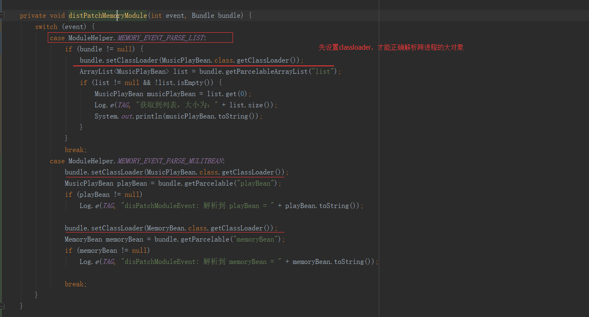
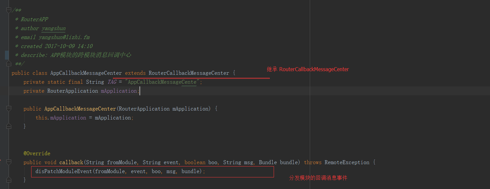
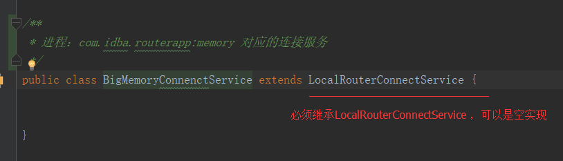
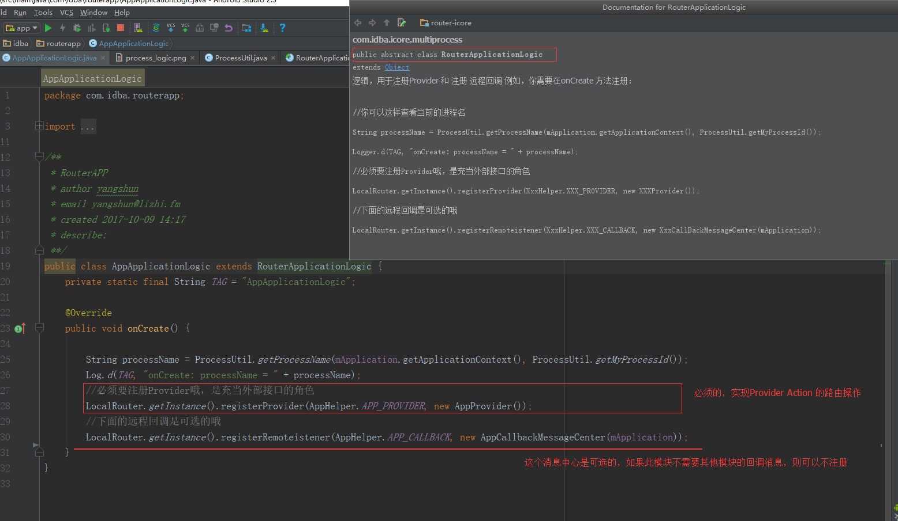
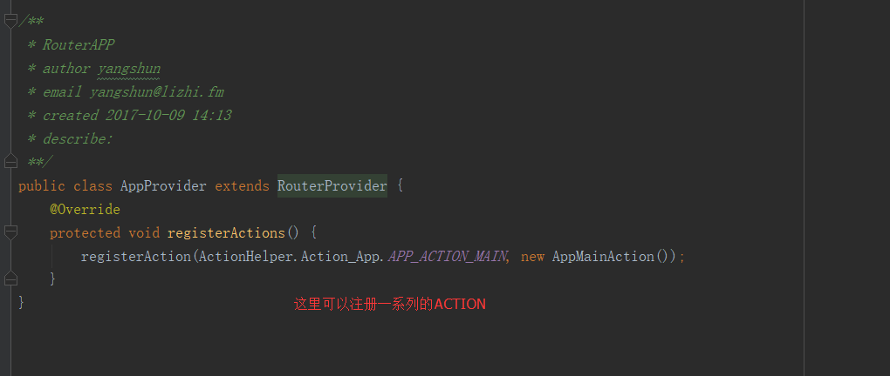
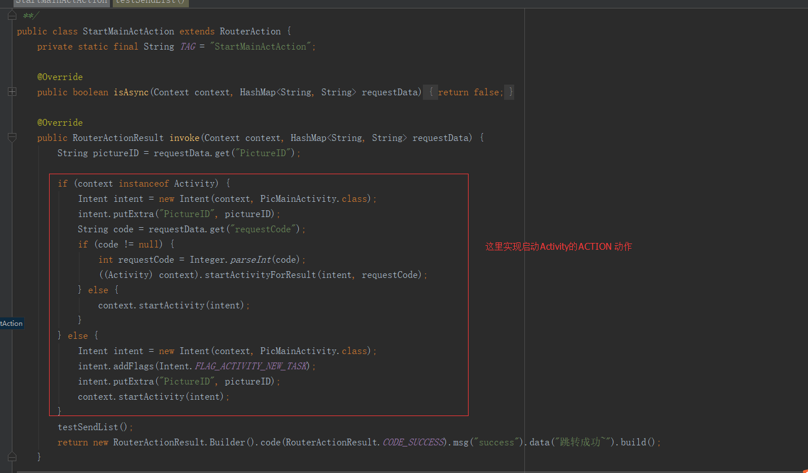

## 路由方案

### 架构图

### 模块间的Activity跳转

### activity的栈：  
activity的跳转仍然遵从同一个进程间的任务栈模式：  
模块A的ActivityA 启动 模块B的activityB，他们仍然处于同一个task。验证：打开命令面板：输入：adb shell dumpsys activity activities 如下，activity的任务栈信息：  
  

### Application的配置方式

   
	

	
	/**
	 * RouterAPP
	 * author IDBA
	 * email radio.ysh@qq.com
	 * created 201709 17:59
	 **/
	public class MyApplication extends RouterApplication {
	    @Override
	    public void onCreate() {
	        super.onCreate();
	        BlockCanary.install(this, new AppBlockCanaryContext()).start();
	    }
	
	    /**
	     * 每增加一个进程，必须有对应的一个的连接服务（第一步回调）
	     */
	    @Override
	    public void initializeAllProcessRouter() {
	        WideRouter.registerLocalRouter("com.idba.routerapp", MainRouterConnectService.class);
	        WideRouter.registerLocalRouter("com.idba.routerapp:memory", BigMemoryConnenctService.class);
	        WideRouter.registerLocalRouter("com.idba.routerapp:music", MusicConnectService.class);
	    }
	
	    /**
	     * 每个模块，或者一个模块存在两个进程，就需要定义一个Logic类（第二步回调）
	     */
	    @Override
	    protected void initializeLogic() {
	        registerApplicationLogic("com.idba.routerapp", 999, AppApplicationLogic.class);
	        registerApplicationLogic("com.idba.routerapp", 999, MusicApplicationLogic.class);
	        registerApplicationLogic("com.idba.routerapp:music", 999, MusicApplicationLogic.class);
	        registerApplicationLogic("com.idba.routerapp", 998, PicApplicationLogic.class);
	        registerApplicationLogic("com.idba.routerapp:memory", 998, MemoryApplicationLogic.class);
	    }
	    /**
	     * 添加需要自启的进程，以及连接服务，保证后续的性能（第三步回调）
	     */
	    @Override
	    protected void addBackGroundStartProcess() {
	        addProcess("com.idba.routerapp:memory", BigMemoryConnenctService.class);
	        addProcess("com.idba.routerapp:music", MusicConnectService.class);
	    }
	    @Override
	    public boolean needMultipleProcess() {
	        return true;
	    }
	}

 

### 模块间的回调方式-发送端  

方法1：

	 /**
     * 将消息回调给指定的Module接收
     *
     * @param toModuleCallback 指定接收消息module的callback
     * @param fromModule       消息来自哪个module
     * @param eventCode        消息的EventCode
     * @param boo              未定义含义
     * @param msg              message
     * @param bundle           bundle 发送的大对象包裹
     * @return callback是否发送成功
     */
    public synchronized boolean sendEventCallback(String toModuleCallback, String fromModule, String eventCode, boolean boo, String msg, Bundle bundle) 
       

方法2：

  	/**
     * 发送消息，默认所有module能够接收此消息
     *
     * @param fromModule 消息来自哪个module
     * @param eventCode  消息的EventCode
     * @param boo        未定义含义
     * @param msg        message
     * @param bundle     bundle 发送的大对象包裹
     * @return callback是否发送成功
     */
    public synchronized boolean sendEventCallbackForAll(String fromModule, String eventCode, boolean boo, String msg, Bundle bundle) 

     
调用方式1 指定模块接受callback回调：

		//构造bundle
 		Bundle bundle = new Bundle();
        ArrayList<MusicPlayBean> list = getList(1000);
        bundle.putParcelableArrayList("list", list);

		//发送callback ，第一个参数 CallBackHelper.CALLBACK_APP  指定APP模块才能接受到此Callback
        LocalRouter.getInstance().sendEventCallback(CallBackHelper.CALLBACK_APP, ModuleHelper.Module.MODULE_BIG_MEMORY, ModuleHelper.EventMemory.PARSE_LIST, true, "启动memory页面，独立进程，这个是远程回调方法！", bundle);

  

调用方式2 全部模块都能接收到callback回调：

		//构造Bundle
 		Bundle bundle = new Bundle();
        MusicPlayBean playBean = new MusicPlayBean().setDuration(12 * 60).setSpeed(100).setArtist("古巨基").setName("情歌王").setAuthor(100);
        bundle.putParcelable("playBean", playBean);

        MemoryBean memoryBean = new MemoryBean().setTotalSize(1024).setRelaySize(450);
        bundle.putParcelable("memoryBean", memoryBean);

		// sendEventCallbackForAll 这个方法发送的回调，所有模块都能接收到
        LocalRouter.getInstance().sendEventCallbackForAll(ModuleHelper.Module.MODULE_BIG_MEMORY, ModuleHelper.EventMemory.PARSE_MULITBEAN, true, "启动memory页面，独立进程，这个是远程回调方法！", bundle);

模块间的回调支持发送以下消息：  
	**基本数据类型：int，String boolean 后面可扩展至 double float long**     
	**自定义的大对象：实现Parcelable 接口的对象**   
	**List列表**   
	**同时发送多个大对象**   
	  

### 模块间的回调方式-接收端

### 如何处理模块回调的消息？
一个APP分多个模块时候，必然出现平级模块间的通讯问题，如何统一处理呢？   
解决方案：每一个模块都定义了一个消息中心类，专门处理不同模块间的消息回调事件。

 

	
	 /**
	     * 分发不同模块传递的事件消息
	     *
	     * @param module
	     * @param event
	     * @param b
	     * @param msg
	     * @param bundle
     */
    private void disPatchModuleEvent(String module, String event, boolean b, String msg, Bundle bundle) {
        switch (module) {
            case ModuleHelper.Module.MODULE_APP:
                break;
            case ModuleHelper.Module.MODULE_BIG_MEMORY://分发Memory模块事件
                distPatchMemoryModule(event,b,msg, bundle);
                break;
            case ModuleHelper.Module.MODULE_MUSIC://分发音乐模块事件
                dispatchMusicModuleEvent(event,b,msg, bundle);
                break;
            case ModuleHelper.Module.MODULE_PIC://分发图片模块事件
                dispatchPicModule(event,b,msg, bundle);
                break;
        }
    }

### 每个进程对应的连接服务  
为什么每个进程都需要对应一个连接服务呢？  
**每个进程，本质上是一个独立的JVM**，如果需要跟其他进程（其他JVM）进行通信，则必须需要一个连接服务，去连接广域路由，达到跟其他进程通讯的桥梁，所有的连接逻辑已经在 LocalRouterConnectService 类实现，所以他们的子类只需要空实现就可以了。

### 每个模块，每个进程 对应的Logic 类   
Logic类的作用是什么？  
    
    public abstract class RouterApplicationLogic

所有的Logic类的父类是 RouterApplicationLogic ，它是一个抽象的类，功能是在 onCreate 方法实现注册Provider，同时也可以注册远程回调的通知中心（可选）。  
provider 是作为一个路由跳转的提供者，其包含了一系列的Action，提供路由之间跳转的路径。

### Provider 类的实现

### Action 类的实现  

invoke 方法，根据需求实现自己模块的逻辑方法，

例如，启动Activity 可以如下方式书写：  
 

### 路由的跳转例子（Activity的启动）

路由的跳转支持注解方式跳转，并且推荐这样使用，简洁方便。    
这个例子是Activity的启动，其他更多的路由方式的Action 类似，可以根据自己的需求自定义Action。

1、先定义一个接口服务：
	
	/**
	 * Router
	 * author IDBA
	 * email radio.ysh@qq.com
	 * created 2017-10-16 11:20
	 * describe:
	 **/
	public interface AppRouterService {

	    /**
	     * 控制音乐模块的音乐播放，并且传递一个musicId
	     * @param context
	     * @param musicId
	     * @return
	     */
	
	    @CombinationUri(domain =DomainHelper.DOMAIN_MUSIC,provider = ProviderHelper.PROVIDER_MUSIC,action =  ActionHelper.Action_Music.MUSIC_ACTION_PLAY)
	    String startMusicModulePlay(Context context,@IntentExtrasParam("musicId") String musicId);
	
	
	    /**
	     * 跳转至图片模块的Activity，以 startActivityForResult 的方式跳转
	     * （note：暂时仅支持在相同进程中 实现 startActivityForResult 方式跳转）
	     * @param context
	     * @param PictureID
	     * @param requestCode
	     * @return
	     */
	    @CombinationUri(domain =DomainHelper.DOMAIN_PIC,provider = ProviderHelper.PROVIDER_PIC ,action = ActionHelper.Action_Pic.PIC_ACTION_MAIN)
	    String startPicModuleActivityForResult(Context context,@IntentExtrasParam("PictureID") String PictureID,@IntentExtrasParam("requestCode") String requestCode);
	
	    /**
	     * 跳转至图片模块的Activity，以 startActivity 的方式跳转
	     * @param context
	     * @param PictureID
	     * @return
	     */
	    @CombinationUri(domain = DomainHelper.DOMAIN_PIC,provider = ProviderHelper.PROVIDER_PIC,action =ActionHelper.Action_Pic.PIC_ACTION_MAIN)
	    String startPicModuleActivity(Context context,@IntentExtrasParam("PictureID") String PictureID);
	
	    /**
	     * 跳转至 大内存模块，另一个进程 的Activity，以 startActivity 的方式跳转
	     * @param context
	     * @param memorySize
	     * @return
	     */
	    @CombinationUri(domain = DomainHelper.DOMAIN_MEMORY,provider = ProviderHelper.PROVIDER_MEMORY,action = ActionHelper.Action_Memory.MEMORY_ACTION_STARTMAIN)
	    String startToBigMemory(Context context,@IntentExtrasParam("memorySize") String memorySize);
	}

2、在MainActivity中获取这个类的实例
	
		AppRouterService appRouterService = LocalRouter.getInstance().create(AppRouterService.class);

3、调用

	
	//                启动方式1 （存在依赖情况）
	//                startActivity(new Intent(MainActivity.this, BigMemoryMainActivity.class));
	//                启动方式2（传统路由方式）
	//                startToBigMemory();
	//                启动方式3（注解方式，推荐使用）

                long start1 = System.currentTimeMillis();

                String memory = appRouterService.startToBigMemory(MainActivity.this, "1024");

                long time1 = System.currentTimeMillis() - start1;
                String text1 = "路由跳转 —> 其他模块的其他进程耗时：" + time1 + "毫秒";
                System.out.println(text1);
                Toast.makeText(this, text1, Toast.LENGTH_SHORT).show();
                Toast.makeText(this, memory, Toast.LENGTH_SHORT).show();

4、在大内存模块，它对应的Action类 的invoke方法

	
	/**
	 * RouterAPP
	 * author IDBA
	 * email radio.ysh@qq.com
	 * created 201709 16:03
	 **/
	public class StartBigemoryMainActAction extends RouterAction {
	    private static final String TAG = "StartBigemoryMainActAct";
	
	    @Override
	    public boolean isAsync(Context context, HashMap<String, String> requestData) {
	        return false;
	    }
		
		/**
	     * 实现这个Action的具体逻辑事件
	     * @param context
	     * @param requestData
	     * @return
	     */
	    @Override
	    public RouterActionResult invoke(Context context, HashMap<String, String> requestData) {
			//从这个 requestData hashMap中获取通过路由传递的参数
	        String memorySize = requestData.get("memorySize");
	        if (context instanceof Activity) {
	            Intent intent = new Intent(context, BigMemoryMainActivity.class);
	            intent.putExtra("memorySize", memorySize);
	            context.startActivity(intent);
	        } else {
	            Intent intent = new Intent(context, BigMemoryMainActivity.class);
	            intent.putExtra("memorySize", memorySize);
	            intent.addFlags(Intent.FLAG_ACTIVITY_NEW_TASK);
	            context.startActivity(intent);
	        }

			// 如果不需要通知，则可以 return null;
	        return new RouterActionResult.Builder().code(RouterActionResult.CODE_SUCCESS).msg("success").data("跳转成功~").build();
	
	    }

5、在 BigMemoryMainActivity 类中，可以通过注解的方式解析

	
	public class BigMemoryMainActivity extends AppCompatActivity {
	    private static final String TAG = "BigMemoryMainActivity";
	    private Handler handler = new Handler();
	    private MemoryRouterService memoryRouterService;
	
	//    获取 memorySize 方式2,注解方式声明注解字段
	    @InjectParams
	    String memorySize;
	
	    @Override
	    protected void onCreate(Bundle savedInstanceState) {
	        super.onCreate(savedInstanceState);
	        setContentView(R.layout.activity_big_memory_main);
	        memoryRouterService = LocalRouter.getInstance().create(MemoryRouterService.class);
	
	//        获取 memorySize 方式1：原生api解析
	//        Bundle extras = getIntent().getExtras();
	//        if (extras != null) {
	//            String memorySize = extras.getString("memorySize");
	//            System.out.println("memorySize = " + memorySize);
	//        }
	
	//        获取 memorySize 方式2,注解方式
	        RouterInjector.inject(this);
	        System.out.println("memorySize = " + memorySize);
	        Toast.makeText(this, memorySize, Toast.LENGTH_SHORT).show();
	
	    }

